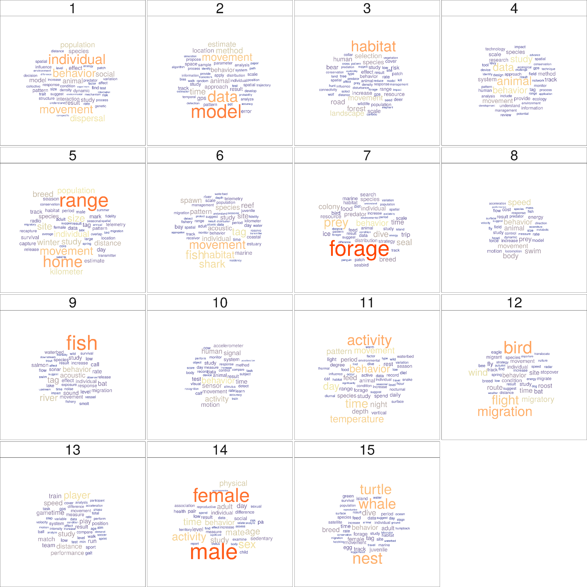
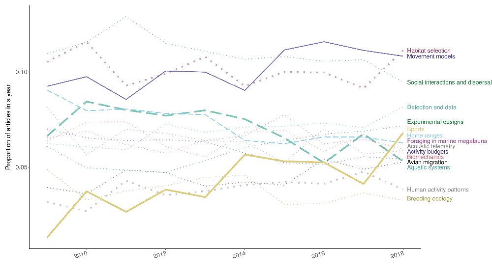
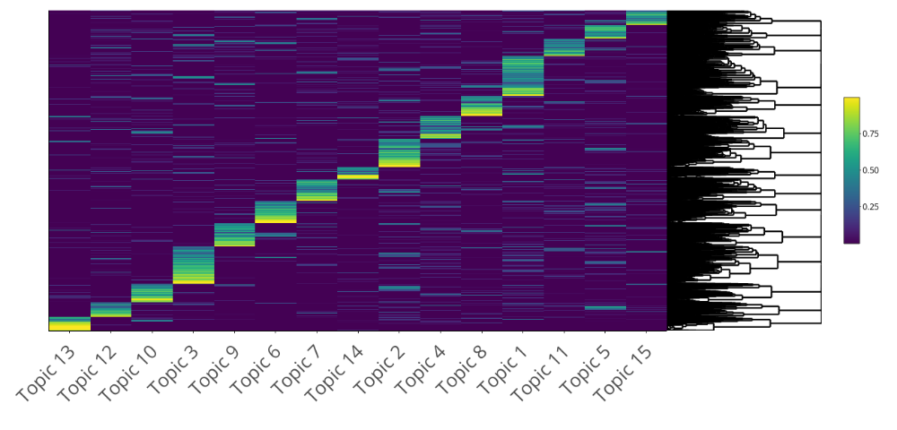
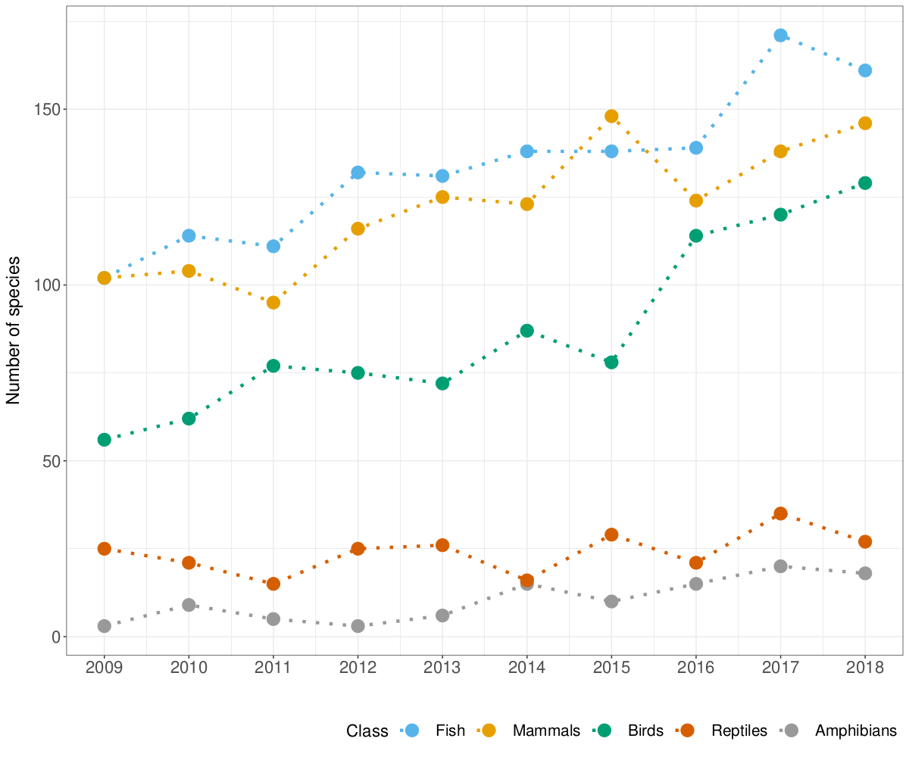
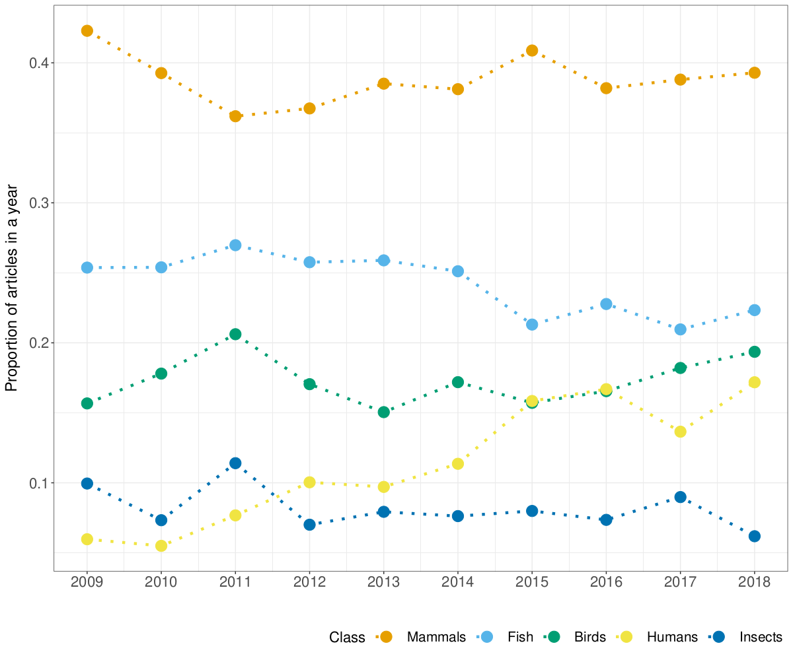
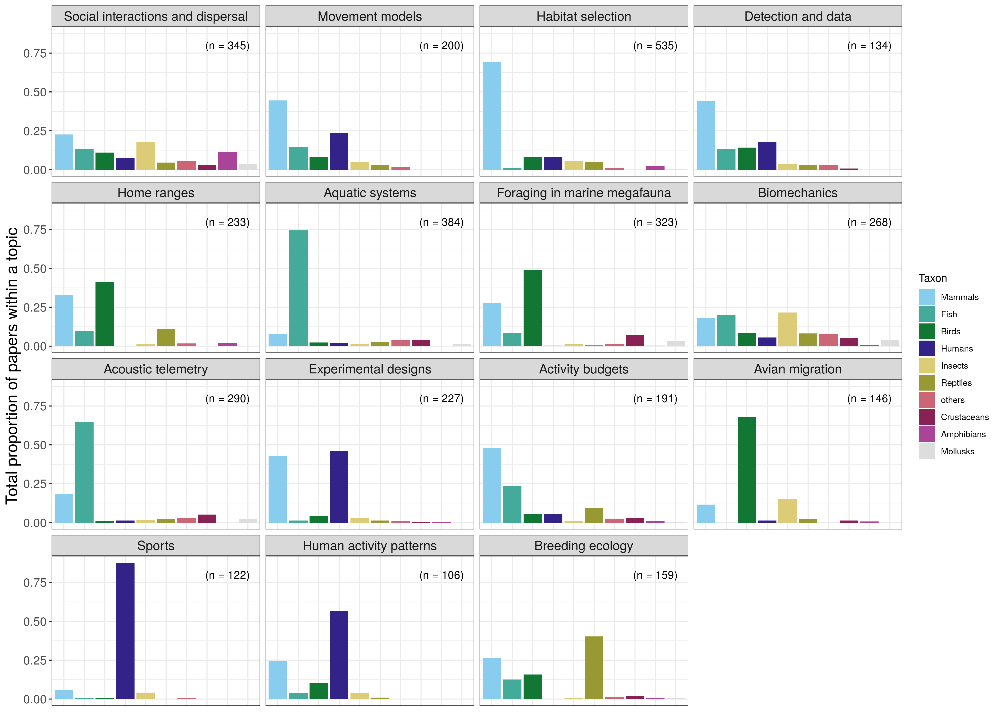
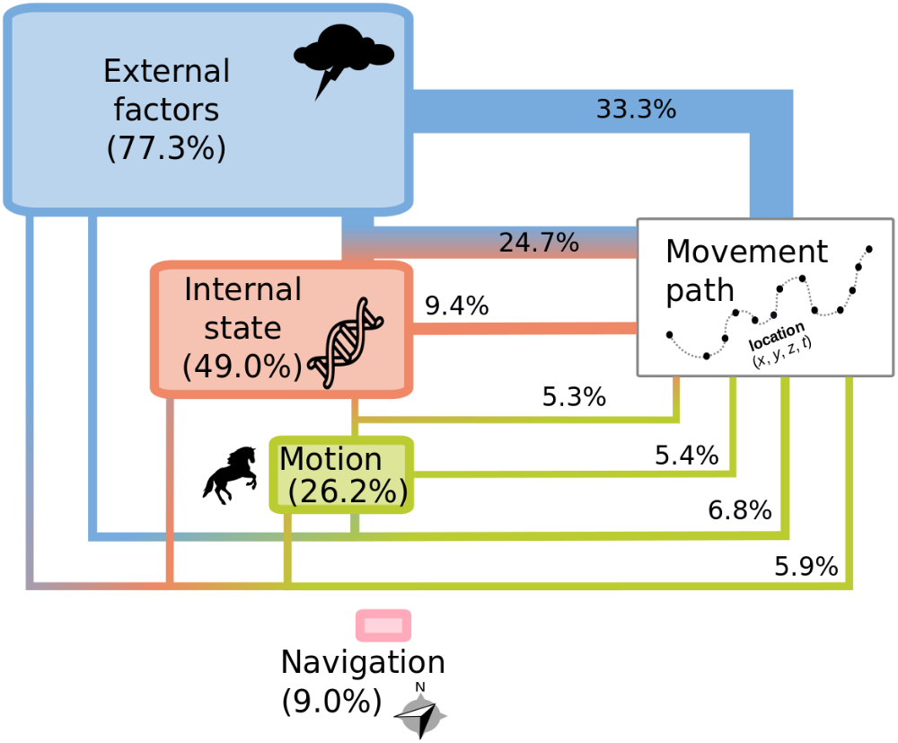
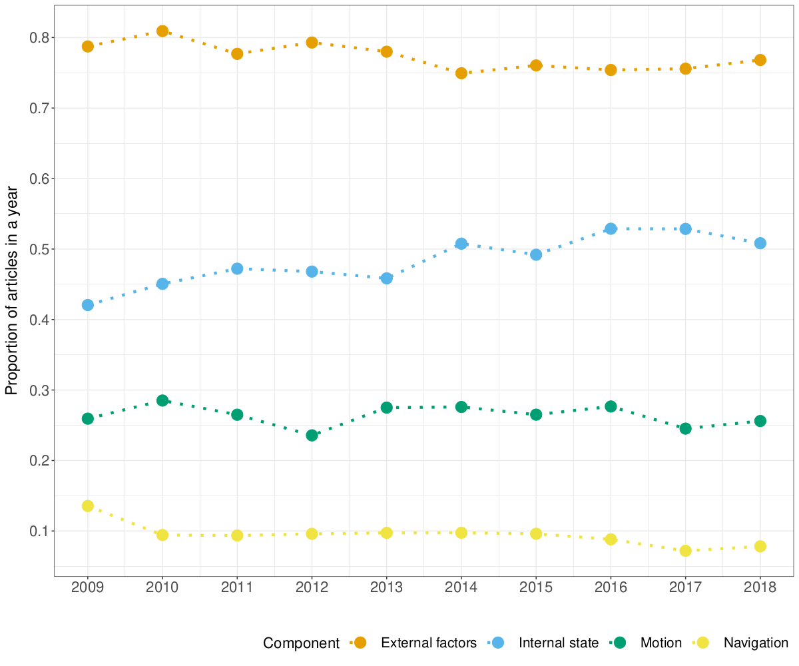
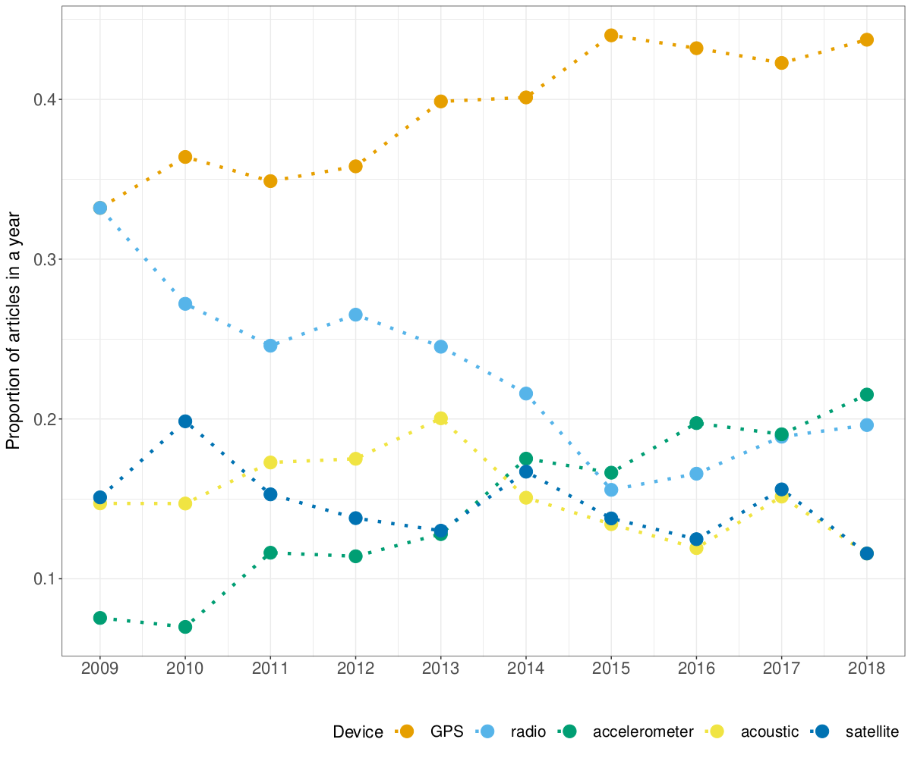
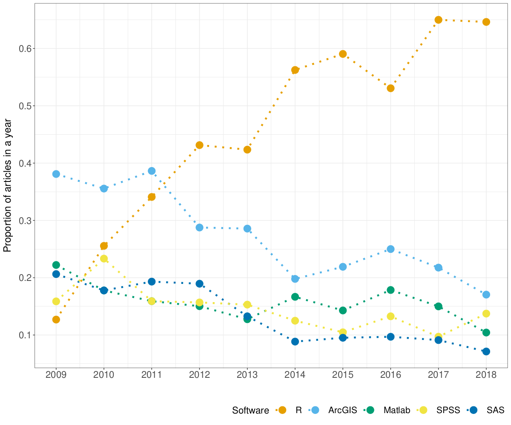

# Data analysis {#analyses}

Several dimensions of the mov-eco literature were analyzed: research **topics**,
**taxonomical** groups studied, components of the movement ecology **framework**
studied, tracking **devices** used, **software** tools used, and statistical
**methods** applied. Depending on the dimension, we either analyzed the title,
keywords, abstract or material and methods (M&M). The sections used for each
aspect of the analysis are detailed in the following table.

|Dimension|Title|Keywords|Abstract|M&M|
|--- |--- |--- |--- |--- |
|Topics|||X||
|Taxonomy|X|X|X||
|Framework|X|X|X||
|Devices|X|X|X|X|
|Software|X|X|X|X|
|Methods|X|X|X|X|

## Topic analysis


This section was removed from the most recent version of the manuscript.

<center>
{width=70%}

Stages of topic analysis.
</center>
<br />

The topics were not defined a priori.
Instead, we fitted Latent Dirichlet Allocation (LDA) models to the abstracts
(@Blei2003).

### The model 

LDAs are Bayesian mixture models that assume the existence of a fixed number $K$
of topics behind the abstracts.
Each topic can be characterized by a multinomial distribution of words with
parameter $\beta$, drawn from a Dirichlet distribution with parameter
$\gamma$. 
Each document $d \in {1, ..., D}$ is composed by a mixture of topics, drawn
from a multinomial distribution with parameter $\theta$, which is drawn from a
Dirichlet distribution with parameter $\alpha$. 
For each word $w$ in document $d$, first a hidden topic $z$ is selected from the
multinomial distribution with parameter $\theta$.
From the selected topic $z$, a word is selected based on the multinomial
distribution with parameter $\beta$.
The log-likelihood of a document $d = \{w_1,...,w_N\}$ is
$l(\alpha,\beta) = \log(p(d|\alpha,\beta)) = \log\int\sum_z\left[\prod_{n=1}^{N} p(w_i|z_i,\beta)p(z_i|\theta)\right]p(\theta|\alpha)d\theta$

Here we used the LDA model with variational EM estimation (@Wainwright2008, @Blei2003) 
implemented in the *topicmodels* package. All the details of the model 
specification and estimation are in @Grun2011. 

The model assumes exchangeability (i.e. the order of words is negligible), that
topics are uncorrelated, and that the number of topics is known.

The most commonly used criterion to choose a number of topics is the perplexity
score or likelihood of a test dataset (@Waal2008). 
Basically, this quantity measures the degree of uncertainty a language model has
when predicting some new text (for this study, a new abstract of a paper). 
Lower values of the perplexity is good and it means the model is assigning
higher probabilities. 
However, the perplexity score measures predictive capacities, rather than having
actual humanly-interpretable latent topics (@Chang2009). 
In fact, using this score could result in there being too many topics; see
@Griffiths2004 who analyzed PNAS abstracts and obtained 300 topics. 
Hence, we decided to fix the number of topics to 15, as a
reasonable value that would not be too large than we could not interpret them,
or too small that the topics were too general.

<center>
{width=80%}

Schematic representation of the links between words, documents and topics. 
Each document is a mixture of topics. Each topic is modeled as a distribution of words. 
Each word comes out of one of these topics. 
Source of the image: Blei, D.M. 2012. Probabilistic topic models. Communications of the ACM, 55(4), 77-84.
</center>
<br />

<center>
{width=80%}

Schematic representation of the Latent Dirichlet model described above.
</center>
<br />


### Preprocessing

To improve the quality of our LDA model outputs, we cleaned the data by 1)
removing redundant words for identifying topics (e.g. prepositions and
numbers), 2) converting all British English words to American English so they
would not be seen as different words, 3) lemmatizing (i.e. extracting the lemma
of a word based on its intended meaning, with the aim of grouping words under
the same lemma) (@Ingason2008), 4) filtering out words that were only used once
in the whole set of abstracts. R packages *tidytext* (@Silge2016), *tm* and
*textstem* (@Rtextstem) were used in this [stage (click to
download)](R/02-CleaningWords_TopicModeling.R).


### Model fitting

The parameter estimates of the LDA model were obtained by running 20 replicates
of the models (with the VEM estimation method), and keeping the one with the
highest likelihood; [click here to download the
code](R/02-TopicModelingScript_rj.R). 


### Model outputs


From the fitted LDA model, we can obtained:

1)  $E(\beta | z,w)$, as the posterior expected values of word distribution per
    topic, denoted by $\hat{\beta}$, and

2)  $E(\theta\_d | z)$, the posterior topic distribution per abstract, denoted
    by $\gamma$ in the package.

The $\hat{\beta}$ values were thus a proxy of the importance of a word in
a topic. They were used to interpret and label each topic, and to create
wordclouds for each topic, where the area occupied by each word was proportional
to its $\hat{\beta}$ value. 

<center>
{width=100%}

Wordclouds of each topic based on $\hat{\beta}$ values. 
Download the codes for the plot [here](R/02-wordcloud_plot.R).
</center>
<br />

Since $\gamma$ indicated the degree of association between an abstract and a topic, 
we obtained a [sample (click to
download)](Data/Topics/sample_validation_top_Ntopics_15_method_VEM_II.csv) of
the 5 most associated abstracts to each topic, to aid the interpretation of the
topics.

Based on these outputs, the topics were interpreted as: 1) Social interactions 
and dispersal, 2)  Movement models, 3)  Habitat selection, 4)  Detection and 
data, 5)  Home ranges, 6)  Aquatic systems, 7)  Foraging in marine megafauna, 
8)  Biomechanics, 9)  Acoustic telemetry, 10) Experimental designs, 11) Activity 
budgets, 12) Avian migration, 13) Sports, 14) Human activity patterns, 
15) Breeding ecology. For an extended description of these topics, see the main text of the manuscript. 


The sum of $\gamma$ values for each topic ($\sum_d E(\theta_d | z_k)$ for each $k$) served as proxies of the
"prevalence" of the topic relative to all other topics and were used to rank
them. 

<center>
{width=50%}

Measure of prevalence of each topic. 
Download the codes for the plot [here](R/02-prevalence_topic_barplot.R).
</center>
<br />


<center>
{width=100%}

Time series of the relative prevalence of each topic every year. 
The code can be downloaded from [here](R/man_topics_trend_plot.R).
</center>
<br />

A heatmap of the $\gamma$ values also showed that most papers were evidently more associated to one topic and few were splitted into several topics.


<center>
{width=100%}

Heatmap of $\gamma$ values per abstract and topic. 
The corresponding code can be downloaded clicking [here](R/02-heatmap_plot.R).
</center>
<br />  


### Model assessment

We assess the consistency and interpretation of the LDA results via internal and
external expert judgement, respectively.

#### Consistency

In the heatmap, we showed that most papers were more strongly associated to one
topic.
To check for consistency, for each topic, we compared its wordcloud with one 
obtained from abstracts that were highly associated with the topic 
($\gamma > 0.75$). 
The two wordclouds should be telling a very similar story, thus visually 
resemble, with very small differences due to the abstracts being composed --in 
a small proportion --by other topics as well.
We selected the papers with $\gamma > 0.75$, and computed the number of
times each unique word occurred in the abstracts related to the topic. 
We divided those values by the total number of words in the topic to get a 
relative frequency $\eta$. 
We then created wordclouds for each topic, where the area occupied by each word 
was proportional to its $\eta$ value.
These wordclouds were overall consistent with the topic wordclouds, i.e. most
words were the same, and the words that differ provided complementary
information to interpret the topics and understand to which types of abstracts
they were strongly associated to.


<center>
{width=100%}

Wordclouds of each topic based on most strongly associated abstracts. 
The code for this plot can be downloaded clicking [here](R/02-wordcloud_plot_II.R).
</center>
<br />

#### Interpretation

To assess the interpretability of the topics, we performed a word intrusion 
analysis, i.e. people are given the task to identify a word injected into the 
top‐terms of each topic.
For each topic, we identified the 
[4 highest-probability words (click to download)](Data/Topics/word_intrusion/word_intrusion_real.csv), 
i.e. with the highest $\hat{\beta}$ values. 
We did not use a higher number of words in the word intrusion tests as we
considered that it could have required more effort from the researchers who
kindly and voluntarily participated in this process. 
Then, we took a high-probability word from another topic --that was not 
'movement' or 'behavior' as they were highly related to most topics --and [added
it to the group; download file with intruder here](Data/Topics/word_intrusion/word_intrusion_test.csv).
We asked 10 researchers in the field to identify the intruder in each group of 
words without any more explanations, and suggested them to answer fast so that they
would not have to overthink; their answers are
[here](https://github.com/rociojoo/mov-eco-review/tree/master/Data/Topics/word_intrusion).
We then computed the number of correct answers for each topic. 
A high score for a topic would indicate that the topic was easy to interpret 
using the 4 highest associated words to it. 

The scores are shown in the table below. 
The codes written for this analysis are 
[downloadable clicking here](R/02-Word_Intrusion.R).

|Topic number | Topic label                       | Score (from 0 to 10)  |
|-------------|---------------------------------  | ----------------------|
| 1           | Social interactions and dispersal | 7                     |
| 2           | Movement models                   | 10                    |
| 3           | Habitat selection                 | 9                     |
| 4           | Detection and data                | 5                     |
| 5           | Home ranges                       | 8                     |
| 6           | Aquatic systems                   | 8                     |
| 7           | Foraging in marine megafauna      | 10                    |
| 8           | Biomechanics                      | 0                     |
| 9           | Acoustic telemetry                | 1                     |
| 10          | Experimental designs              | 3                     |
| 11          | Activity budgets                  | 2                     |
| 12          | Avian migration                   | 9                     |
| 13          | Sports                            | 0                     |
| 14          | Human activity patterns           | 5                     |
| 15          | Breeding ecology                  | 4                     |

Topics 1, 2, 3, 5, 6, 7 and 12 got high scores (>7). 
A few of the low-scored topics ($\leq 5$) had a word intrusion that could be considered 
relatively general for the researchers thus confusing, such as "tag" (topic 4) and 
"data" (topics 9 and 15). 
Moreover, the two topics highly associated with humans, 13 and 14, also had low
scores that could be a consequence of the researchers (all ecologists) not 
expecting any human related group. 
Overall, this analysis shows that only half of the topics are easily 
interpretable using the 4 highest-probability words.
Even for us, the researchers involved in this study, it was necessary to look
at the abstracts with the highest association to each topic in order to be sure
of the interpretation of some of the topics.

An alternative approach to model assessment in topics is through topic
prediction on an independent data set, but this should be performed when the
goal of the study is to predict over new data sets, which is not the case here.

The word intrusion approach is not an exhaustive assessment of topic
interpretability, but it allows putting our results into perspective: some
topics have a clear and easy interpretation and some others are really hard to
interpret.


## Taxonomical identification

To identify the taxonomy of the organisms studied in the papers, the ITIS
(Integrated Taxonomic Information System) database (USGS Core Science Analytics
and Synthesis) was used to detect names of any animal species (kingdom Animalia)
that were mentioned in the abstracts, titles and keywords. We screened these
sections for latin and common (i.e., vernacular) names of species (both singular
and plural), as well as common names of higher taxonomic levels such as orders
and families. We excluded ambiguous terms that are used as common names for taxa
but also have a current language meaning; for example: "Here", "Scales",
"Costa", "Ray", etc. Because we wanted to consider humans as a separate
category, we excluded "Homo sapiens" from the search terms, but used the
following non-ambiguous terms to identify papers that focus on movement ecology
of humans: 
```
"player", "players", "patient", "patients", "child", "children",
"teenager", "teenagers", "people", "student", "students", "fishermen", "person",
"tourist", "tourists", "visitor", "visitors", "hunter", "hunters", "customer",
"customers", "runner", "runners", "participant", "participants", "cycler",
"cyclers", "employee", "employees", "hiker", "hikers", "athlete", "athletes",
"boy", "boys", "girl", "girls", "woman", "women", "man", "men", "adolescent",
"adolescents". 
```
In cases where words may be suffixes of larger words, we used
regular expression notation to exact match words, e.g 'man' must match only the
word 'man' and not 'manually'. We excluded words that could have an
ambiguous meaning: "passenger" may appear in papers that mention passenger
pigeons; "driver" may be used to refer to a causing factor.

After having identified any taxon mentioned in a paper, we summarized taxa at
the Class level (except for superclasses Osteichthyes and Chondrichthyes which
we merged into a single group labeled Fish, and for classes within the phylum
Mollusca and the subphylum Crustacea which we considered collectively). Thus,
each paper was classified as focusing on one or more class-like groups, as in
@Holyoak2008: Fish, Mammals, Birds, Reptiles, Amphibians, Insects, Crustaceans,
Mollusks, and others. For the purpose of our analysis, we kept humans as a
separate category and did not count them within Class Mammalia. 

The quality control procedure consisted in selecting a random sample of 100
abstracts and verifying that the common taxonomical group was correctly
identified. The accuracy was 93%. The code for taxonomical identification can be
downloaded [here](R/taxonomy_analysis.R).


### Outputs  
  

<center>
{width=70%}

Number of species studied in each year for the five classes with most studied species.
More species have been studied in the last years. [The code for plot can be downloaded here](R/02-species_plots.R).
</center>
<br /> 


<center>
{width=70%}

Proportion of papers in each year studying each of the five most commonly studied taxonomic groups.
  A paper can study several taxonomic groups, hence the proportions for each year can sum up to more than one.
  [The code for plot can be downloaded here](R/man_taxa_trend_plot.R).
</center>
<br /> 

<center>
{width=100%}

For each topic, relative frequencies of papers studying each taxonomical group. Only papers with more than 50% of association to each topic are used for this graph. [The code for plot can be downloaded here](R/man_taxa_topic_barplot.R).
</center>
<br /> 


## Movement ecology framework (MEF)

A unifying conceptual framework for movement ecology was proposed in
@Nathan2008. It consisted of four components: external factors (i.e. the set of
environmental factors that affect movement), internal state (i.e. the inner
state affecting motivation and readiness to move), navigation capacity (i.e. the
set of traits enabling the individual to orient), and motion capacity (i.e. the
set of traits enabling the individual to execute movement). The outcome of the
interactions between these four components would be the observed movement path
(plus observation errors). 

To assess the study of the different components of the movement ecology
framework, we built what we call here a "dictionary". A dictionary is composed
of concepts and associated words. Here, the concepts of interest were the
components of the framework (i.e. internal state, external factor, motion and
navigation), and their associated words were the terms potentially used in the
abstracts to refer to the study of each component. For example, terms like
"memory", "sensory information", "path integration" or "orientation" were used
to identify the study of navigation. The framework dictionary is [downloadable here](Data/Dictionary/csv-updated-versions/Dictionaries-Framework.csv).

To assessed how well the dictionary identified the components in the papers, a
quality control procedure was established. For each aspect, a random sample
of 100 papers was selected, and a coauthor who did not lead the construction of
the dictionary was randomly selected to check if in those papers the categories
of the dictionary were correctly identified (i.e. accuracy). The accuracy
was 91%. 

We replicated this analysis for the 1999-2008 period for comparison purposes.

### Outputs

|Component            |2009-2018| 1999-2008|
|---------------------|---------| ---------|
|External factors     |   77.3% |     76.7%|
|Internal state       |   49.0% |     45.7%|
|Motion capacity      |   26.2% |     27.3%|
|Navigation capacity  |   9.0%  |     11.7%|

Framework components. The values are the percentages of abstracts (where
information on the framework was gathered) that use terms related to each
component. 

<center>
{width=75%}

Representation of the components of the movement ecology framework and how much they were studied in the last decade: external factors, internal state, motion and navigation capacities, whose interactions result in the observed movement path. 
The size of each component box is proportional to the percentage of papers (in parentheses) tackling them irrespectful of whether they are only about this component or in combination with another one. The latter is specified through the segments that join the components to the observed movement path. One fill color corresponds to papers that only studied one component, while two or more colors correspond to papers that tackled two or three components, respectively (the ones from those colors). The width of the segment is proportional to the percentage of papers that studied that combination (or single component). Only combinations corresponding to $>5\%$ of papers are shown; e.g. combinations involving navigation and papers studying navigation on its own had $<5\%$ of papers each therefore they are not shown in the graph. This graph was made using Inkscape. The percentages in it and an alternative graphical representation of them can be found in [this downloadable code](R/man_framework_stack_plot.R).
</center>
<br /> 

<center>
{width=75%}

Representation of the components of the movement ecology framework and how much they were studied between 1999 and 2008: external factors, internal state, motion and navigation capacities, whose interactions result in the observed movement path. 
The size of each component box is proportional to the percentage of papers (in parentheses) tackling them irrespectful of whether they are only about this component or in combination with another one. The latter is specified through the segments that join the components to the observed movement path. One fill color corresponds to papers that only studied one component, while two or more colors correspond to papers that tackled two or three components, respectively (the ones from those colors). The width of the segment is proportional to the percentage of papers that studied that combination (or single component). Only combinations corresponding to $>5\%$ of papers are shown; e.g. combinations involving navigation and papers studying navigation on its own had $<5\%$ of papers each therefore they are not shown in the graph. This graph was made using Inkscape. The percentages in it and an alternative graphical representation of them can be found in [this downloadable code](R/man_framework_stack_plot_1999_2008.R).
</center>
<br /> 


<center>
{width=70%}

Proportion of papers in each year focusing on each component of the MEF.
		A study can focus on more than one component, hence the proportions for each year can sum up to more than one.
  [The code for plot can be downloaded here](R/man_frame_trend_plot.R).
</center>
<br /> 


<center>
{width=100%}

Proportion of papers studying each taxonomic class for each component of the MEF.
		Papers associated to several components were accounted for in several frames.
  [The code for plot can be downloaded here](R/man_frame_taxa_barplot.R).
</center>
<br /> 


## Tracking devices

We grouped tracking devices in 11 categories. These categories were meant to be
as monophyletic as possible, and so broad categories had to be defined. Also,
use of one technology does not rule out the use of another technology. E.g.
radio + GPS is frequently used, and marine studies frequently have an array of
sensors on them that may combine multiple technologies. These categories are:

1. Light loggers: Any technology that records light levels and derives locations based on the timing of twilight events.
2. Satellite: Any tag that collects location via, and sends data to, satellites, so that data can be accessed remotely. Frequently, the ARGOS system.  
3. Radio telemetry: Any technology that infers location based on radio telemetry (VHF/UHF frequency). Sometimes it is used in addition to either light logger or GPS technology, though this distinction cannot be readily inferred using our methodology.
4. Camera:  They include any device that records location/presence via photos
or video; mainly camera traps with known locations where the capture of the 
individual implies the location.  
5. Video:  They include any device that records movement via video.   
6. Acoustic:  Any technology that uses sound to infer location, either in a similar way to radio telemetry or in an acoustic array where animal vocalizations are recorded and the location of sensors in the array are used to obtain an animal location.  
7. Pressure: Any technology that records pressure readings (frequently in the water), and these changes infer vertical movement, such as through a water column.
8. Accelerometer: Any technology that is placed on a subject and measures the acceleration of the tag, and this delta infers movement.
9. Body conditions: Any technology that uses body condition sensors to collect data on the subject that may be associated with a movement or lack thereof, such as temperature and heart rate.  
10. GPS: Any technology that uses Global Position System satellites to calculate the location of an object. Can be handheld GPS devices, or animal-borne tags.  
11. Radar: Any technology that uses "radio detection and ranging" devices to track objects. Can be large weather arrays or tracking radars.  
12. Encounter: Any analog tracking method where the user must capture the subject and place a marker on the subject. The recapturing/resighting of the subject infers the movement. This category was difficult to capture in our study due to a lack of specific phrases that can be used.  

Their use was assessed with a dictionary approach. The dictionary can be downloaded [here](Data/Dictionary/csv-updated-versions/Dictionaries-Data.csv). 

To assess how well the dictionary identified the types of devices in the papers, a quality control procedure was established. For each aspect, a random sample
of 100 papers was selected, and a coauthor who did not lead the construction of
the dictionary was randomly selected to check if in those papers the categories
of the dictionary were correctly identified (i.e. accuracy). The accuracy
was 84%. 

To assess if we were identifying animal-borne GPS rather than hand-held GPS, we took a sample of 100 
papers already associated to GPS according to our dictionary. 83 referred to GPS
tags, 12 were hand held, and 5 were neither tag nor hand-held (e.g. GPS coordinates in general, or General Practitioners).


### Output

<center>
{width=100%}

Proportion of papers in each year using the five most commonly used tracking devices.
	A study can use more than one device, hence the proportions for each year can sum up to more than one.
	[The code for plot can be downloaded here](R/man_data_trend_plot.R).
</center>
<br /> 


## Software

Here we also used a dictionary approach. We used expert opinion to compile all 
known software used in movement ecology.  The 33 software in our list were 1) R, 
2) Python, 3) SPSS, 4) Matlab, 5) SAS, 6) MARK (program Mark and not R package 
unmarked), 7) Java, 8) C (if researchers wrote C code themselves; i.e some 
tracking Radars for pre-processing), 9) Fortran, 10) WinBUGS, 11) Agent-Analyst,
12) BASTrack, 13) QGIS, 14) GRASS, 15) Microsoft Excel, 16) Noldus observer, 
17) fragstats, 18) postgis (we separated postGIS from the database category 
because its high spatial analytical capabilities), 19) databases (any relational 
database, likely for data management and summarizing necessarily for analyitical 
use), 20) e-surge, 21) m-surge, 22) u-care, 23) Genstat,
24) Biotas, 25) Statview, 26) Primer-e, 27) PAST, 28) STATA, 29) Statistica, 
30) UCINET, 31) Mathcad, 32) Vicon, and 33) GME (geospatial modeling environment).
The dictionary with the terms used can be downloaded [here](Data/Dictionary/csv-updated-versions/Dictionaries-Software.csv). 

For quality control, we examined a random sample of 50 papers. The accuracy
was 88%.  

### Output


<center>
{width=100%}

Proportion of papers in each year using the five most commonly used software.
	A study can use more than one software, hence the proportions for each year can sum up to more than one. [The code for plot can be downloaded here](R/man_software_trend_plot.R).
</center>
<br /> 


## Statistical methods

Within our dictionary approach, we first used expert opinion to compile all known statistical methods (and terms used for them) that could have been used in movement ecology, resulting in 188 terms; [click here to download the corresponding file](Data/Dictionary/Methods-Classification.csv). 
We classified statistical methods into Spatial, Time-series, Movement, Spatiotemporal, Social, and Generic. Their definitions are below:

1. Spatial: spatial statistical methods (e.g. geostatistics)
2. Time-series: time series methods (e.g. functional data analysis)
3. Movement: statistical method used for the study of movement (e.g. behavioral change point analysis)
4. Spatiotemporal: spatiotemporal but not movement methods (e.g. spatiotemporal geostatistics)
5. Social: statistical methods that are not exclusively for movement, but that characterize or model social processes (e.g. social networks)
6. Generic: generic statistical methods that could be used in any type of study, that are not inherently spatial, temporal or social (e.g. a regression analysis)

Terms related to hypothesis tests were first considered but ultimately removed; we considered that the tendency of papers to present p-values could be biasing researchers towards the use of hypothesis tests, thus creating a bias towards general methods. 

For quality control, we examined a random sample of 50 papers. The accuracy
was 84%.  

### Outputs


<center>
{width=100%}

Proportion of papers in each year mentioning each type of statistical method.
		A study can use more than one type of method, hence the proportions for each year can sum up to more than one. [The code for the plot can be downloaded here](R/man_method_trend_plot.R). 
</center>
<br /> 


| generic | Movement  | spatial | time-series | social | spatiotemporal |
|---------|-----------|---------|-------------|--------|----------------|
| 67.8%   |  32.6%    |  18.9%  |   16.5%     | 3.3%   |    0.3%        |

Table. Percentage of papers using each type of statistical method. The code for this table can be downloaded [here](R/man_method_trend_plot.R). 


| trigram                         | n   |
|---------------------------------|-----|
| linear mixed models             | 231 |
| linear mixed effects            | 229 |
| generalized linear mixed        | 202 |
| mixed effects models            | 202 |
| linear mixed model              | 188 |
| markov chain monte              | 180 |
| chain monte carlo               | 178 |
| akaike's information criterion  | 174 |
| akaike information criterion    | 162 |
| minimum convex polygon          | 158 |
| information criterion aic       | 146 |
| monte carlo mcmc                | 133 |
| correlated random walk          | 129 |
| mixed effects model             | 117 |
| hidden markov model             | 116 |


Table. Most common statistical trigrams in M&M sections of papers (with more than 100 mentions in papers). To reconstruct this table, readers can refer to [this downloadable code](R/trigrams.R). 


*The code to process the dictionaries of the framework, tracking devices, software, statistical methods, and taxonomy is [downloadable here](R/02-Dictionary_Analysis.R).

