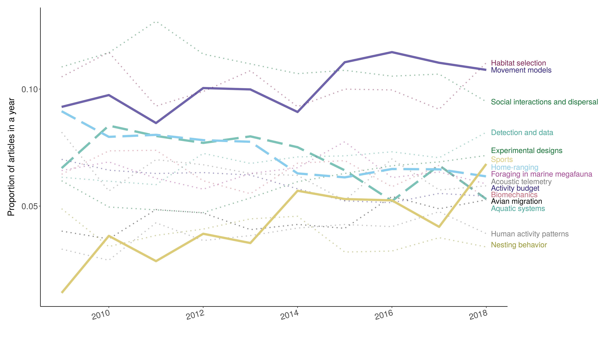

# Data analysis {#analyses}

Several dimensions of the mov-eco literature were analyzed: research **topics**,
**taxonomical** groups studied, components of the movement ecology **framework**
studied, tracking **devices** used, **software** tools used, and statistical
**methods** applied. Depending on the dimension, we either analyzed the title,
keywords, abstract or material and methods (M&M). The sections used for each
aspect of the analysis are detailed in the following table.

|Dimension|Title|Keywords|Abstract|M&M|
|--- |--- |--- |--- |--- |
|Topics|||X||
|Taxonomy|X|X|X||
|Framework|X|X|X||
|Devices|X|X|X|X|
|Software|X|X|X|X|
|Methods|X|X|X|X|

## Topic analysis

{width=70%}

Stages of topic analysis.

 

The topics were not defined a priori. Instead, we fitted Latent Dirichlet
Allocation (LDA) models to the abstracts (@Blei2003). LDAs are basically
three-level hierarchical Bayesian models for documents (in our case, abstracts).
Here we assumed that there were latent or hidden topics behind the abstracts,
and that the choice of words in the abstracts were related to the topics the
authors were addressing. Thus, an abstract would have been composed of one or
more topics, and a topic would have been composed of a mixture of words. The
probability of a word appearing in an abstract depended on the topic the
abstract was addressing. There are several variations of topic models (@Nunez-Mir2016). 
Here we used the LDA model with variational EM estimation (@Wainwright2008) 
implemented in the *topicmodels* package. All the details of the model 
specification and estimation are in @Grun2011. 

{width=80%}

Schematic representation of the links between words, documents and topics. 
Each document is a mixture of topics. Each topic is modeled as a distribution of words. 
Each word comes out of one of these topics. 
Source of the image: Blei, D.M. 2012. Probabilistic topic models. Communications of the ACM, 55(4), 77-84.

 

### Preprocessing

To improve the quality of our LDA model outputs, we cleaned the data by 1)
removing redundant words for identifying topics (e.g. prepositions and
numbers), 2) converting all British English words to American English so they
would not be seen as different words, 3) lemmatizing (i.e. extracting the lemma
of a word based on its intended meaning, with the aim of grouping words under
the same lemma) (@Ingason2008), 4) filtering out words that were only
used once in the whole set of abstracts. R packages *tidytext* (@Silge2016), 
*tm* and *textstem* (@Rtextstem) were used in this [stage](R/02-CleaningWords_TopicModeling.R).

### Fitting LDAs

The parameter estimates of the LDA model were obtained by running 20 replicates
of the models (with the VEM estimation method), and keeping the one with the
highest likelihood; see [here](R/02-TopicModelingScript_rj.R). A key argument in
the fitting function is the number of latent topics. The most commonly used
criterion to choose a number of topics is the perplexity score or likelihood of
a test dataset (@Waal2008). Basically, this quantity measures the degree of
uncertainty a language model has when predicting some new text (for this study,
a new abstract of a paper). Lower values of the perplexity is good and it means
the model is assigning higher probabilities. However, the perplexity score
measures predictive capacities, rather than having actual humanly-interpretable
latent topics (@Chang2009). In fact, using this score could result in there
being too many topics; see @Griffiths2004 who analyzed PNAS abstracts and
obtained 300 topics. Hence, we decided to fix the number of topics to 15, as a
reasonable value that would not be too large than we could not interpret them,
or too small that the topics were too general.

### Model outputs

From the fitted LDA model, we obtained:

1) the probabilities of having a word in
a document given the presence of a certain topic (denoted by $\beta$), and 

2) the probabilities of a topic being referred to in each document (denoted by
$\gamma$). 

The $\beta$ values were thus a proxy of the importance of a word in
a topic. They were used to interpret and label each topic, and to create
wordclouds for each topic, where the area occupied by each word was proportional
to its $\beta$ value. 

{width=100%}

Wordclouds of each topic based on $\beta$ values. See the codes for the plot [here](R/02-wordcloud_plot.R).

 

Since $\gamma$ indicated the degree of association between an abstract and a topic, 
we obtained a [sample](Data/Topics/sample_validation_top_Ntopics_15_method_VEM_II.csv) of the 5 most associated abstracts to each topic, to aid the
interpretation of the topics.

Based on these outputs, the topics were interpreted as: 1) Social interactions 
and dispersal, 2)  Movement models, 3)  Habitat selection, 4)  Detection and 
data, 5)  Home-ranging, 6)  Aquatic systems, 7)  Foraging in marine megafauna, 
8)  Biomechanics, 9)  Acoustic telemetry, 10) Experimental designs, 11) Activity 
budget, 12) Avian migration, 13) Sports, 14) Human activity patterns, 
15) Breeding ecology. For an extended description of these topics, see the main text of the manuscript. 

The sum of $\gamma$ values for each topic served as proxies of the
"prevalence" of the topic relative to all other topics and were used to rank
them. 

{width=50%}

Measure of prevalence of each topic. See the codes for the plot [here](R/02-prevalence_topic_barplot.R).

 

{width=100%}

Time series of the relative popularity of each topic every year.

 

To check for consistency, for each topic, we selected the papers that were
highly associated with the topic ($\gamma > 0.75$), and computed the number of
times each unique word occurred in the abstracts related to the topic. We
divided those values by the total number of words in the topic to get a relative
frequency, denoted by $\delta$. We then created wordclouds for each topic,
where the area occupied by each word was proportional to its $\delta$ value.
These wordclouds were consistent with the topic wordclouds, and gave
complementary information. 

{width=100%}

Wordclouds of each topic based on most strongly associated abstracts.

 

Also for consistency, a heatmap of the $\gamma$ values also showed that most
papers were evidently more associated to one topic and few were splitted into
several topics.

{width=100%}

Heatmap of $\gamma$ values per abstract and topic. 

   

All the codes to get the model outputs are in [PASTE LINK]

## Taxonomical identification

To identify the taxonomy of the individuals studied in the papers, the ITIS
(Integrated Taxonomic Information System) database (USGS Core Science Analytics
and Synthesis) was used to detect names of any animal species (kingdom Animalia)
that were mentioned in the abstracts, titles and keywords. We screened these
sections for latin and common (i.e., vernacular) names of species (both singular
and plural), as well as common names of higher taxonomic levels such as orders
and families. We excluded ambiguous terms that are used as common names for taxa
but also have a current language meaning; for example: "Here", "Scales",
"Costa", "Ray", etc. Because we wanted to consider humans as a separate
category, we excluded "Homo sapiens" from the search terms, but used the
following non-ambiguous terms to identify papers that focus on movement ecology
of humans: "player", "players", "patient", "patients", "child", "children",
"teenager", "teenagers", "people", "student", "students", "fishermen", "person",
"tourist", "tourists", "visitor", "visitors", "hunter", "hunters", "customer",
"customers", "runner", "runners", "participant", "participants", "cycler",
"cyclers", "employee", "employees", "hiker", "hikers", "athlete", "athletes",
"boy", "boys", "girl", "girls", "woman", "women", "man", "men", "adolescent",
"adolescents". In cases where words may be suffixes of larger words, we used
regular expression notation to exact match words, e.g 'man' must match only the
word 'man' and not 'human' or 'postman'. We excluded words that could have an
ambiguous meaning: "passenger" may appear in papers that mention passenger
pigeons; "driver" may be used to refer to a causing factor.

After having identified any taxon mentioned in a paper, we
summarized all taxa at the Class level. Thus, each paper was classified as
focusing on one or more Classes: Fish, Mammals, Birds, Reptiles, Amphibians,
Insects, Crustaceans, Mollusks, and others. For
the purpose of our analysis, we kept Humans as a separate category and did not
count them within Class Mammalia. 

The quality control procedure consisted in selecting a random sample of 100
abstracts and verifying that the common taxonomical group was correctly
identified. The accuracy was 93%. The code for taxonomical identification can be
found in
<https://github.com/rociojoo/MovEcoReview-Repository/blob/master/R/taxonomy_analysis_meb.R>

### Outputs  
  

{width=70%}

More species have been studied in the last years. 

  

{width=70%}

Proportion of papers in each year studying each taxonomical group.

  

The codes to produce these graphs are in [PASTE LINK]

## Movement ecology framework (MEF)

A unifying conceptual framework for movement ecology was proposed in
@Nathan2008. It consisted of four components: external factors (i.e. the set of
environmental factors that affect movement), internal state (i.e. the inner
state affecting motivation and readiness to move), navigation capacity (i.e. the
set of traits enabling the individual to orient), and motion capacity (i.e. the
set of traits enabling the individual to execute movement). The outcome of the
interactions between these four components would be the observed movement path
(plus observation errors). 

To assess the study of the different components of the movement ecology
framework, we built what we call here a "dictionary". A dictionary is composed
of words and their meanings. Here, the words of interest were the components of
the framework (i.e. internal state, external factor, motion and navigation), and
their meanings were the terms potentially used in the abstracts to refer to the
study of each component. For example, terms like "memory", "sensory
information", "path integration" or "orientation" were used to identify the
study of navigation. The framework dictionary is in:
<https://github.com/rociojoo/MovEcoReview-Repository/blob/master/Data/Dictionary/csv-updated-versions/Dictionaries-Framework.csv>

To assessed how well the dictionary identified the components in the papers, a
quality control procedure was established. For each aspect, a random sample
of 100 papers was selected, and a coauthor who did not lead the construction of
the dictionary was randomly selected to check if in those papers the categories
of the dictionary were correctly identified (i.e. accuracy). The accuracy
was 91%. 

### Outputs

|Component            |2009-2018| 1999-2008|
|---------------------|---------| ---------|
|External factors     |   77.3% |     76.7%|
|Internal state       |   49.0% |     45.7%|
|Motion capacity      |   26.2% |     27.6%|
|Navigation capacity  |   9.0%  |     11.8%|

Framework components. The values are the percentages of abstracts (where
information on the framework was gathered) that use terms related to each
component. 

{width=50%}

## Tracking devices

We grouped tracking devices in 11 categories. These categories were meant to be
as monophyletic as possible, and so broad categories had to be defined. Also,
use of one technology does not rule out the use of another technology. E.g.
radio + GPS is frequently used, and marine studies frequently have an array of
sensors on them that may combine multiple technologies. These categories are:

1. Light loggers: Any technology that records light levels and derives movement from the change in light levels.  
2. Satellite: Any tag that collects location via, and sends data to, satellites so that data can be accessed remotely. Frequently the ARGOS system.  
3. Radio telemetry: Any technology that infers location based on radio telemetry (VHF/UHF frequency). Sometimes it is in addition to either light logger or GPS technology, though this destinction can not be reasily infered via our methods.  
4. Video/camera:  Any data that records movement or location via photos or video. Either camera traps with known locations and the capture of the individual implies the location, or recording observations where the movement across the screen is the movement being collected (tracking spiders on a grid).  
5. Acoustic:  Any technology that uses sound to infer location, either in a similar technique as radio telemetry or in an acoustic array where the animals sound is record and the arrays location infers the location.  
6. Pressure: Any technology that records pressure readings (frequently in the water), and these changes infer movement, as through a water column.  
7. Accelerometer: Any technology that is placed on a subject and measures the acceleration of the tag, and this delta infers movement.
8. Body conditions: Any technology that uses body condition sensors to collect data on the subject that may be associated with a movement or lack thereof, such as temperature and heart rate.  
9. GPS: Any technology that uses Global Position System satellites to calculate the location of an object. Can be handheld GPS devices, or tags that are mounted and must be retrieved on a subject.  
10. Radar: Any technology that uses "radio detection and ranging" devices to track objects. Can be large weather arrays or tracking radars.  
11. Encounter: Any analog tracking tactic where the user must capture the subject and place a marker on the subject. The recapturing/resighting of the subject infers the movement. This category is understandably very difficult to capture as the exact phrases must be used.  

Their use was assessed with a dictionary approach. The dictionary is here <https://github.com/rociojoo/MovEcoReview-Repository/blob/master/Data/Dictionary/csv-updated-versions/Dictionaries-Data.csv>.

To assessed how well the dictionary identified the types of devices in the papers, a
quality control procedure was established. For each aspect, a random sample
of 50 papers was selected, and a coauthor who did not lead the construction of
the dictionary was randomly selected to check if in those papers the categories
of the dictionary were correctly identified (i.e. accuracy). The accuracy
was XX%.  [Still waiting for Mathieu]

To assess if we were identifying GPS biologging devices, i.e. 
attached to the tracked individuals, or rather hand-held GPS, we took a sample of 100 
papers already associated to GPS according to our dictionary. 83 referred to GPS
tags, 12 were hand held, and 5 were neither tag nor hand-held (e.g. GPS coordinates in general, or General Practitioners).

### Output

{width=50%}

Proportion of papers of each year using each type of
device. 

  

The code for the graph is [PASTE LINK]

## Software

Here we also used a dictionary approach. We used expert opinion to compile all 
known software used in movement ecology.  Also during manual checks of software
we did not find obvious missing software. The 33 software in our list were 1) R, 
2) Python, 3) SPSS, 4) Matlab, 5) SAS, 6) MARK (program Mark and not R package 
unmarked), 7) Java, 8) C (if researchers wrote C code themselves; i.e some 
tracking Radars for pre-processing), 9) Fortran, 10) WinBUGS, 11) Agent-Analyst,
12) BASTrack, 13) QGIS, 14) GRASS, 15) Microsoft Excel, 16) Noldus observer, 
17) fragstats, 18) postgis (we separated postGIS from the database category 
because its high spatial analytical capabilities), 19) databases (any relational 
database, likely for data management and summarizing necessarily for analyitical 
use), 20) e-surge, 21) m-surge, 22) u-care, 23) Genstat,
24) Biotas, 25) Statview, 26) Primer-e, 27) PAST, 28) STATA, 29) Statistica, 
30) UCINET, 31) Mathcad, 32) Vicon, and 33) GME (geospatial modeling environment).
More details on the terms used are in 
<https://github.com/rociojoo/MovEcoReview-Repository/blob/master/Data/Dictionary/csv-updated-versions/Dictionaries-Software.csv>.

For quality control, we examined a random sample of 50 papers. The accuracy
was 88%.  

### Output

{width=50%}

Proportion of papers of each year using each software. 

  

[PASTE LINK TO Code for graph]

## Statistical methods

Within a dictionary approach, we first used expert opinion to compile all known statistical methods (and terms used for them) that could have been used in movement ecology. We complemented it with a revisitation of a sample of mov-eco papers and added a few more. 204 terms were finally used <https://github.com/rociojoo/MovEcoReview-Repository/blob/master/Data/Dictionary/csv-updated-versions/Dictionaries-Methods.csv>. 

We classified statistical methods into Spatial, Time-series, Movement, Spatiotemporal, Social, and Generic. Their definitions are below:

1. Spatial: spatial statistical methods (e.g. geostatistics)
2. Time-series: time series methods (e.g. functional data analysis)
3. Movement: statistical method used for the study of movement (e.g. behavioral change point analysis)
4. Spatiotemporal: spatiotemporal but not movement method (e.g. spatiotemporal geostatistics)
5. Social: statistical methods that are not exclusively for movement, but that characterize or model social processes (e.g. social networks)
6. Generic: generic statistical methods that could be used in any type of study, that are not inherently spatial, temporal or social (e.g. a regression analysis)

Terms related to hypothesis tests were first considered but ultimately removed; we considered that the tendency in papers to present p-values could be biasing researchers towards the use of hypothesis tests, thus creating a bias towards general methods. 

For quality control, we examined a random sample of 50 papers. The accuracy
was 84%.  

### Outputs

{width=50%}

Proportion of papers of each year using each type of methods. 

  

| generic | Movement  | spatial | time-series | social | spatiotemporal |
|---------|-----------|---------|-------------|--------|----------------|
| 67.8%   |  32.6%    |  18.9%  |   16.5%     | 3.3%   |    0.3%        |

Table. Percentage of papers using each type of statistical method. 

| trigram                         | n   |
|---------------------------------|-----|
| linear mixed models             | 231 |
| linear mixed effects            | 229 |
| generalized linear mixed        | 202 |
| mixed effects models            | 202 |
| linear mixed model              | 188 |
| markov chain monte              | 180 |
| chain monte carlo               | 178 |
| akaike's information criterion  | 174 |
| akaike information criterion    | 162 |
| minimum convex polygon          | 158 |
| information criterion aic       | 146 |
| monte carlo mcmc                | 133 |
| correlated random walk          | 129 |
| mixed effects model             | 117 |
| hidden markov model             | 116 |

Table. Most common statistical trigrams in M&M sections of papers (with more than 100 mentions in papers).

Codes for graphs and tables in this section are in [PASTE LINK]

