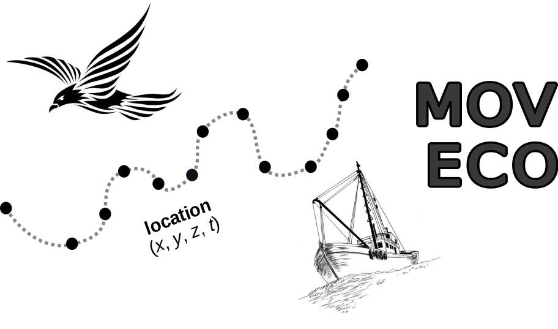

--- 
title: "Recent trends in Movement Ecology: a quantitative review of tools, topics and research gaps"
author: "Rocío Joo, Simona Picardi, Matthew E. Boone, Thomas A. Clay, Samantha C. Patrick, Vilma S. Romero-Romero and Mathieu Basille"
date: "`r Sys.Date()`"
site: bookdown::bookdown_site
output: bookdown::gitbook
documentclass: book
bibliography: ["Bibliography/references_total.bib"]
biblio-style: apalike
link-citations: yes
description: "Quantitative review of the last decade of movement ecology (from 2009 to 2018)"
---

# Introduction

{width=40%}

> **Note:** This is the companion website for the manuscript “Recent trends in Movement Ecology: a quantitative review of tools, topics and research gaps”, from Joo et al., available as an [arXiv pre-print](https://arxiv.org/abs/2006.00110). 

## Abstract of the manuscript

Movement is fundamental to life, shaping population dynamics, biodiversity 
patterns, and ecosystem structure.
Humans have studied movement since classical antiquity, with different perspectives pervading several research fields including physics, physiology, data science, and ecology.
Yet, it was not until around a decade ago that the Movement Ecology Framework (MEF) was proposed as a new paradigm for the study of organismal movement, relying on integrative interdisciplinary research to understand the processes underlying movement.
In parallel, recent technological advances have provided an abundance of tracking data from a large diversity of species and taxa globally, at ever finer spatio-temporal resolutions. 
A decade later, we investigated the current state of research in the field.

Using a text mining approach on \> 8000 peer-reviewed
papers in Movement Ecology, we explored the main research topics,
and assessed changes in the study of the movement components described in the MEF, the use of technological devices, software and statistical methods. 
We found that the number of publications has increased considerably and that there have been major technological changes in the past decade (i.e. increased use of GPS devices, accelerometers and video cameras, and a convergence towards the use of the R software for statistical computing).
On the other hand, we found that research largely focuses on the same questions as it did before the MEF was introduced, such as the effect of environmental factors on
movement, and overall still neglects the study of the underlying movement processes. 

We call on researchers to transform Movement Ecology from technology- to interdisciplinary-driven, in order to reveal key movement processes such as navigation, as well as evolutionary, physiological
and life-history consequences of movement strategies.

{width=50%}

 

