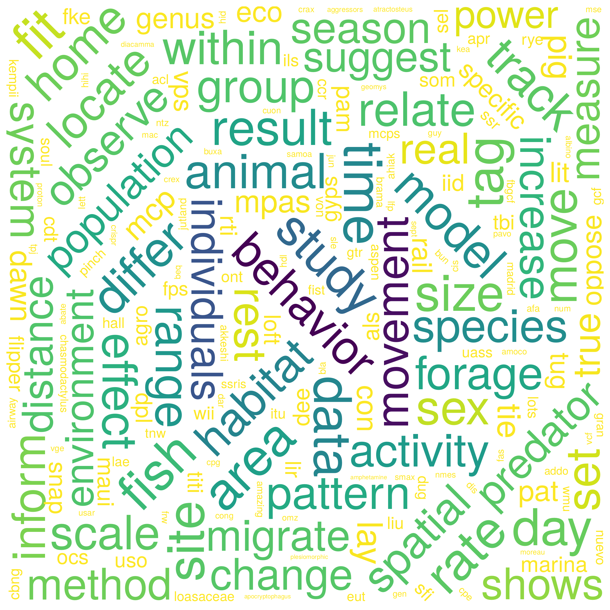

--- 
title: "A decade of movement ecology"
author: "Rocío Joo, Simona Picardi, Matthew E. Boone, Thomas A. Clay, Samantha C. Patrick, Vilma Romero and Mathieu Basille"
date: "`r Sys.Date()`"
site: bookdown::bookdown_site
output: bookdown::gitbook
documentclass: book
bibliography: ["Bibliography/references_total.bib"]
biblio-style: apalike
link-citations: yes
description: "Quantitative review of the last decade of movement ecology (from 2009 to 2018)"
---

# Introduction

{width=40%}

> **Note:** This is the companion website for the manuscript “A decade of movement ecology”,
from Joo et al. 

## Abstract of the manuscript

Movement is fundamental to life, shaping population dynamics, biodiversity
patterns, and ecosystem structure.
Recent advances in tracking technology have enabled fundamental questions about
movement to be tackled, and the number of publications in movement ecology has
increased considerably.
In 2008, the movement ecology framework (MEF) was proposed in a PNAS
special feature on movement ecology (Nathan et al. 2008). 
The MEF introduced an integrative theory of organism movement - linking internal
state, movement capacity and navigation capacity to external factors - and has
been recognized in the literature as a milestone in the field.
Here, over ten years later, we investigated the current state of research. Specifically, we explore the main research topics, evaluate the impact the MEF has had in the literature, and assess changes in the use of technological devices, software and statistical methods. 
To do so, we used a text mining approach to review \> 8000 peer-reviewed papers in movement ecology. 
We found that, while there have been major technological changes in the past decade (i.e. increased use of GPS devices, accelerometers and video cameras, and a convergence towards R), research focusses on the same questions, specifically, on the effect of external (e.g. environmental) factors on movement and behavior. 
In practice, it appears that movement ecology research does not reflect the MEF.
We call on researchers in movement ecology and other disciplines to transform the field from technology-driven to embrace interdisciplinary collaboration.
Through a better linking of different components of the framework, key processes underlying movement, such as navigation, as well as evolutionary, physiological and life-history consequences of particular strategies, can be revealed.

{width=50%}

 

