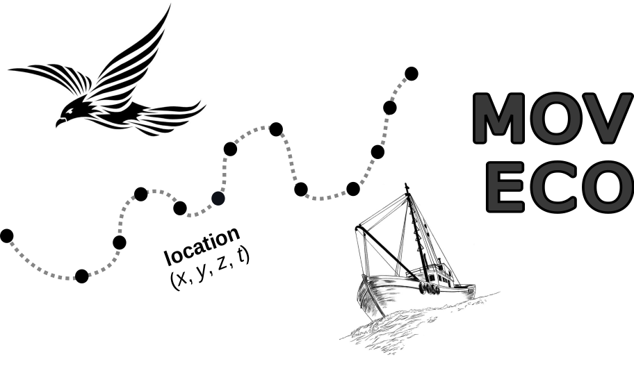

--- 
title: "Recent trends in movement ecology of animals and human mobility"
author: "Rocío Joo, Simona Picardi, Matthew E. Boone, Thomas A. Clay, Samantha C. Patrick, Vilma S. Romero-Romero and Mathieu Basille"
date: "`r Sys.Date()`"
site: bookdown::bookdown_site
output: bookdown::gitbook
output_dir: "docs"
documentclass: book
bibliography: ["Bibliography/references_total.bib"]
biblio-style: apalike
link-citations: yes
description: "Quantitative review of the last decade of movement ecology (from 2009 to 2018)"
---

# Introduction

{width=40%}

This is the companion website for the manuscript “Recent trends in movement ecology of animals and human mobility”,
a quantitative review of animal and human movement literature in 2009-2018 from Joo et al., serving as the manuscript's supplementary information page. The R codes for the analyses are available in [this GitHub repository](https://github.com/rociojoo/mov-eco-review).

A version of this manuscript is available as an [arXiv pre-print](https://arxiv.org/abs/2006.00110). 

## Abstract of the manuscript

  Movement is fundamental to life, shaping population dynamics, biodiversity
  patterns and ecosystem structure.  In 2008, the Movement Ecology Framework
  (MEF; Nathan et al. 2008) introduced an integrative theory of organism
  movement—linking internal state, motion capacity and navigation capacity to
  external factors—which has been recognized as a milestone in the field.
  Since, the study of movement experienced a technological boom, providing
  massive quantities of tracking data globally of both animal and human movement
  at ever finer spatio-temporal resolutions.  In this work, we provide a
  quantitative assessment of the state of research in animal and human movement
  under the MEF.  Using a text mining approach, we reviewed >8000 papers,
  identified tools and methods, and assessed all components of the MEF.  Over
  the past decade, the publication rate has increased considerably, along with
  major technological changes, such as an increased use of GPS devices and
  accelerometers, and a convergence towards the R software.  However, research,
  particularly in animals, still largely focuses on the effect of environmental
  factors on movement, with much less focus on motion and navigation.  We
  discuss the potential for the technological and methodological advances in the
  field to lead to more integrated and interdisciplinary research and the
  exploration of key movement processes like navigation, and evolutionary,
  physiological and life-history consequences of movement.

{width=50%}

 

