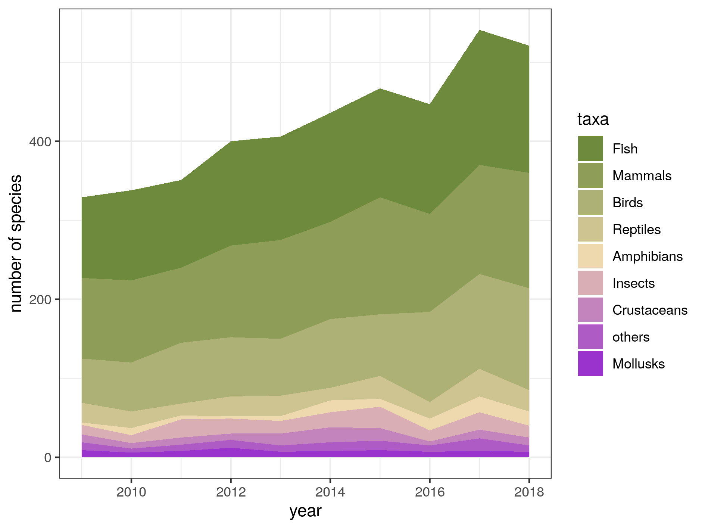
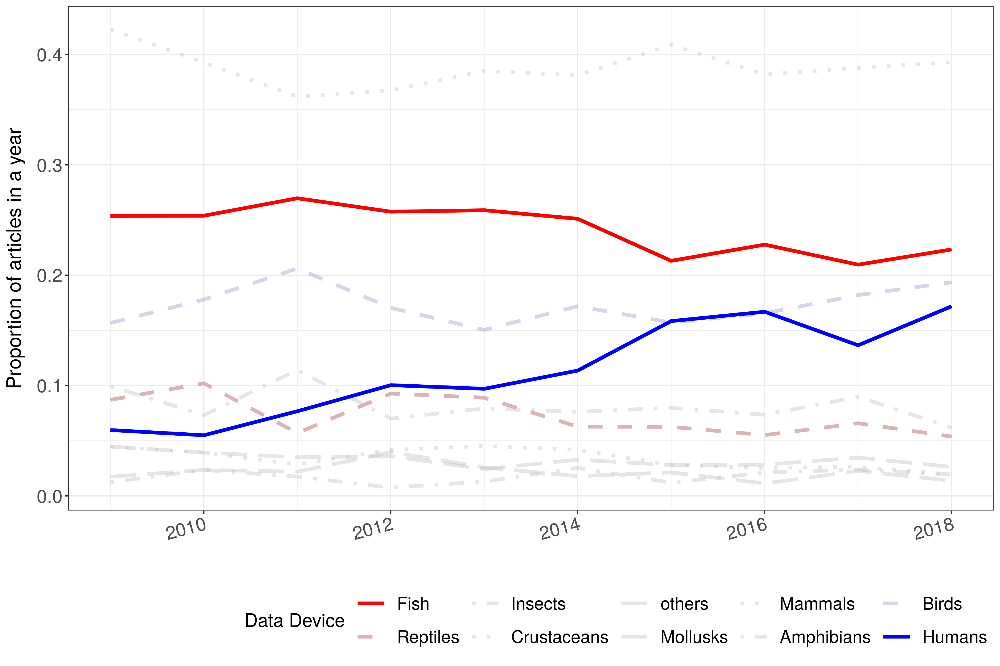

 

# **A decade of movement ecology**

 
 

Rocío Joo, Simona Picardi, Matthew E. Boone, Thomas A. Clay, Samantha C. Patrick, Vilma Romero and Mathieu Basille

 
 

This is the companion website for the manuscript “A decade of movement ecology”,
from Joo et al., available as a preprint here [PASTE LINK]. It is composed of
a series of posts containing the following:

1. <a href=post-moveco1-intro.html>An abstract of the manuscript</a>

2. <a href=post-moveco2-processing.html>Data collection and processing</a>

3. **Data analysis and results** 

    3.1. <a href=post-moveco3-1-topicanalysis.html>Topic analysis</a> 
    
    3.2. **Taxonomical identification** (in this page!)
    
    3.3. <a href=post-moveco3-3-framework.html>Movement ecology framework</a>
    
    3.4. <a href=post-moveco3-4-tools.html>Tracking devices</a>  
    
    3.5. <a href=post-moveco3-4-tools.html>Software</a>
    
    3.6. <a href=post-moveco3-4-tools.html>Statistical methods</a>
    
    
4. Survey about the field of movement ecology applied to movement ecologists

 

## 3. Data analysis

Several dimensions of the mov-eco literature were analyzed: research **topics**,
**taxonomical** groups studied, components of the movement ecology **framework**
studied, tracking **devices** used, **software** tools used, and statistical
**methods** applied. Depending on the dimension, we either analyzed the title,
keywords, abstract or material and methods (M&M). The sections used for each
aspect of the analysis are detailed in the following table.

|Dimension|Title|Keywords|Abstract|M&M|
|--- |--- |--- |--- |--- |
|Topics|||X||
|Taxonomy|X|X|X||
|Framework|X|X|X||
|Devices|X|X|X|X|
|Software|X|X|X|X|
|Methods|X|X|X|X|

## 3.2. Taxonomical identification

To identify the taxonomy of the individuals studied in the papers, the ITIS
(Integrated Taxonomic Information System) database (USGS Core Science Analytics
and Synthesis) was used to detect names of any animal species (kingdom Animalia)
that were mentioned in the abstracts, titles and keywords. We screened these
sections for latin and common (i.e., vernacular) names of species (both singular
and plural), as well as common names of higher taxonomic levels such as orders
and families. We excluded ambiguous terms that are used as common names for taxa
but also have a current language meaning; for example: "Here", "Scales",
"Costa", "Ray", etc. Because we wanted to consider humans as a separate
category, we excluded "Homo sapiens" from the search terms, but used the
following non-ambiguous terms to identify papers that focus on movement ecology
of humans: "player", "players", "patient", "patients", "child", "children",
"teenager", "teenagers", "people", "student", "students", "fishermen", "person",
"tourist", "tourists", "visitor", "visitors", "hunter", "hunters", "customer",
"customers", "runner", "runners", "participant", "participants", "cycler",
"cyclers", "employee", "employees", "hiker", "hikers", "athlete", "athletes",
"boy", "boys", "girl", "girls", "woman", "women", "man", "men", "adolescent",
"adolescents". In cases where words may be suffixes of larger words, we used
regular expression notation to exact match words, e.g 'man' must match only the
word 'man' and not 'human' or 'postman'. We excluded words that could have an
ambiguous meaning: "passenger" may appear in papers that mention passenger
pigeons; "driver" may be used to refer to a causing factor.

After having identified any taxon mentioned in a paper, we
summarized all taxa at the Class level. Thus, each paper was classified as
focusing on one or more Classes: Fish, Mammals, Birds, Reptiles, Amphibians,
Insects, Crustaceans, Mollusks, and others. For
the purpose of our analysis, we kept Humans as a separate category and did not
count them within Class Mammalia. 

The quality control procedure consisted in selecting a random sample of 100
abstracts and verifying that the common taxonomical group was correctly
identified. The accuracy was 93%. The code for taxonomical identification can be
found in
<https://github.com/rociojoo/MovEcoReview-Repository/blob/master/R/taxonomy_analysis_meb.R>
  
### Outputs  
  

{width=70%}

More species have been studied in the last years. 

  

{width=70%}

Proportion of papers in each year studying each taxonomical group.

  

The codes to produce these graphs are in [PASTE LINK]
