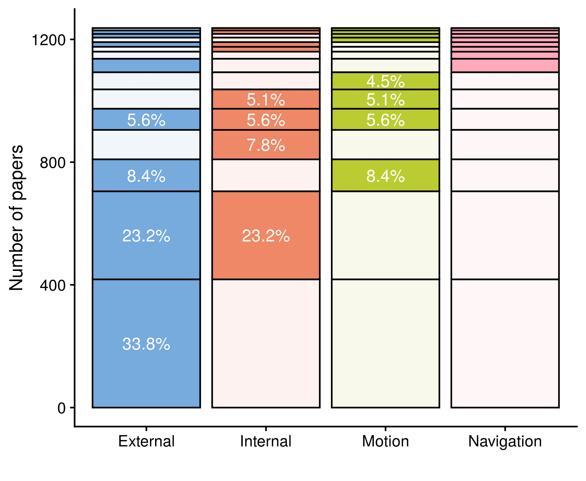

 

# **A decade of movement ecology**

 
 

Rocío Joo, Simona Picardi, Matthew E. Boone, Thomas A. Clay, Samantha C. Patrick, Vilma Romero and Mathieu Basille

 
 

This is the companion website for the manuscript “A decade of movement ecology”,
from Joo et al., available as a preprint here [PASTE LINK]. It is composed of
a series of posts containing the following:

1. <a href=post-moveco1-intro.html>An abstract of the manuscript</a>

2. <a href=post-moveco2-processing.html>Data collection and processing</a>

3. **Data analysis and results** 

    3.1. <a href=post-moveco3-1-topicanalysis.html>Topic analysis</a> 
    
    3.2. <a href=post-moveco3-2-taxonomy.html>Taxonomical identification</a>  
    
    3.3. **Movement ecology framework** (in this page!)
    
    3.4. <a href=post-moveco3-4-tools.html>Tracking devices</a>  
    
    3.5. <a href=post-moveco3-4-tools.html>Software</a>
    
    3.6. <a href=post-moveco3-4-tools.html>Statistical methods</a>
    
    
4. Survey about the field of movement ecology applied to movement ecologists

 

## 3. Data analysis

Several dimensions of the mov-eco literature were analyzed: research **topics**,
**taxonomical** groups studied, components of the movement ecology **framework**
studied, tracking **devices** used, **software** tools used, and statistical
**methods** applied. Depending on the dimension, we either analyzed the title,
keywords, abstract or material and methods (M&M). The sections used for each
aspect of the analysis are detailed in the following table.

|Dimension|Title|Keywords|Abstract|M&M|
|--- |--- |--- |--- |--- |
|Topics|||X||
|Taxonomy|X|X|X||
|Framework|X|X|X||
|Devices|X|X|X|X|
|Software|X|X|X|X|
|Methods|X|X|X|X|

## 3.3. Movement ecology framework (MEF)

A unifying conceptual framework for movement ecology was proposed in
Nathan et al. (2008). It consisted of four components: external factors (i.e. the set of
environmental factors that affect movement), internal state (i.e. the inner
state affecting motivation and readiness to move), navigation capacity (i.e. the
set of traits enabling the individual to orient), and motion capacity (i.e. the
set of traits enabling the individual to execute movement). The outcome of the
interactions between these four components would be the observed movement path
(plus observation errors). 

To assess the study of the different components of the movement ecology
framework, we built what we call here a "dictionary". A dictionary is composed
of words and their meanings. Here, the words of interest were the components of
the framework (i.e. internal state, external factor, motion and navigation), and
their meanings were the terms potentially used in the abstracts to refer to the
study of each component. For example, terms like "memory", "sensory
information", "path integration" or "orientation" were used to identify the
study of navigation. The framework dictionary is in:
<https://github.com/rociojoo/MovEcoReview-Repository/blob/master/Data/Dictionary/csv-updated-versions/Dictionaries-Framework.csv>

To assessed how well the dictionary identified the components in the papers, a
quality control procedure was established. For each aspect, a random sample
of 100 papers was selected, and a coauthor who did not lead the construction of
the dictionary was randomly selected to check if in those papers the categories
of the dictionary were correctly identified (i.e. accuracy). The accuracy
was 91%. 

### Outputs

|Component            |2009-2018| 1999-2008|
|---------------------|---------| ---------|
|External factors     |   77.3% |     76.7%|
|Internal state       |   49.0% |     45.7%|
|Motion capacity      |   26.2% |     27.6%|
|Navigation capacity  |   9.0%  |     11.8%|

Framework components. The values are the percentages of abstracts (where
information on the framework was gathered) that use terms related to each
component. 

{width=50%}

Stack plot of the percentage of studies analyzing the components of the
movement ecology framework (2009-2018). Each row represents a combination of the colored
components, and the percentage of studies analyzing those components is
indicated. 

  

{width=50%}

Stack plot of the percentage of studies analyzing the components of the
movement ecology framework (1999-2008). Each row represents a combination of the colored
components, and the percentage of studies analyzing those components is
indicated.

  

For more details into which external, internal, motion and navigation aspects
were being studied, we divided the terms in the dictionaries into subcategories
defined here
<https://github.com/rociojoo/MovEcoReview-Repository/blob/master/Documentation/ReadMe-FrameworkDictionary.Rmd>
and here
<https://github.com/rociojoo/MovEcoReview-Repository/blob/master/Data/Dictionary/Framework-Internal-Subcategories.csv>.
[PASTE LINK TO CODE]

|External factor    |Percentage | Internal factor    |Percentage |Motion capacity   |Percentage | Navigation capacity|Percentage |
|-------------------|-----------| -------------------|-----------|------------------|-----------| -------------------|-----------|
|Environment        |     80.7% | Adaptation         |     45.9% |Empirical         |     50.9% | Orientation        |     73.6% |
|Animal interaction |     38.1% | Life-history       |     42.2% |Biophysical       |     36.3% | Cognitive          |     25.5% |
|Anthropogenic      |     13.6% | Physiological state|     34.5% |Theoretical       |     32.1% | Sensory            |      7.6% |
|Other              |     3.3%  | Behavior           |     7.2%  |                  |           |                    |           |
|General            |     0.4%  | General            |     1.6%  |                  |           |                    |           |

Categories in which each component of the movement ecology framework is split.
The percentages are computed as the number of abstracts referring to the
category divided by the number of abstracts concerning the correspondent
component, multiplied by 100. 

The codes for dictionary analysis and the production of graphs and tables are in
[COPY LINKS]

Nathan, R., Getz, W. M., Revilla, E., Holyoak, M., Kadmon, R., Saltz, D., &
Smouse, P. E. (2008). A movement ecology framework for unifying organismal
movement research. PNAS, 105(49), 19052–19059.

